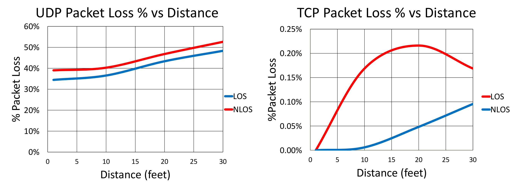

# RobSenCom
This repository will include the necessary resources for RobSenCom project. You can create issue on any of your questions regarding the materials, installation problems.

# Preliminary Experimentation Files
The /preliminary_tests repository contains two files, one named *sender.bash* and another named *receiver.bash* these two files were run on separate robotic agents to generate packet loss results in varying architectures. The only dependencies for the experiment are 
```
- tcpdump
- netcat
- a robot agent with ROS installed and a valid topic currently running. 
```
The topic to be subscribed to and duration for which the sender will record the topic information can be modified in the constants at the top of the *sender.bash* file, similarly IP addresses of robotic agents in experiment have to be specified in the provided files.
To run the experiment the following steps should be followed
```python
# first initiate receiver for listening
./receiver.bash
# next initiate sender to send a file containing topic data given
./sender.bash
# record results from opened terminals and rerun experiment to generate an average packet loss
```


# Package for Testing Performance of Ros2 system
https://github.com/irobot-ros/ros2-performance/tree/foxy

Using the foxy branch, performances/performance_test_factory/examples then the subscriber_nodes_main and publisher_nodes_main code on two separate turtlebots

## Installing GUI for the turtlebot3

After running the following commands the turtlebot3 should now be equipped with a GUI that makes ease of use much easier
```
sudo apt-get install ubuntu-desktop-minimal
sudo reboot
```
Since the network manager before was netplan, in order to use NetworkManager the netplan config file found in */etc/netplan/50-cloud-init.yaml* has to be modified using the following steps in terminal:
````python
sudo nano /etc/netplan/50-cloud-init.yaml
# Convert the file to look like this
```
network:
            version: 2
            renderer: NetworkManager
```
# CTRL+S, CTRL+X to save and quit
sudo netplan apply
sudo reboot
````
Now the network can be managed using the drop down menu at the top right of the screen

## Installing and running performance package on two Turtlebot3 Burger robots
When running a system using two separate turtlebots in a ROS2 foxy system there are two changes that must be added before the performance package can be successfully installed. 

### Adding a Namespace to the turtlebots
The easiest way to separate the nodes and topics of two turtlebots is the use of namespaces. This is done by changing a total of 3 files in the turtlebot3 and LDS packages provided by robotis, starting with the node declaration found in *turtlebot3/turtlebot3_bringup/launch/robot.launch.py* (*tb3_XXX* represents any namespace that should be added to the node and topics associated with it).
```python
Node(
            package='turtlebot3_node',
            namespace='tb3_XXX',          // add this line
            executable='turtlebot3_ros',
            parameters=[tb3_param_dir],
            arguments=['-i', usb_port],
            output='screen'),
```
To complete of adding the namespace the param file must be changed in *turtlebot3/turtlebot3_bringup/param/burger.yaml'
```python
tb3_XXX:                              // add this line at top of file, properly indent following lines
            turtlebot3_node:
                        ...
            
```
Similarly a namespace must be added to the provided lidar package to separate the scan topics completed by changing the node declaration in launch file *ld08_driver/launch/ld08.launch.py*
```python
Node(
            package='ld08_driver',
            namespace='tb3_XXX',    //add this line
            executable='ld08_driver',
            name='ld08_driver',
            output='screen'),
```
After building the package and running the bringup, nodes will now be separated by a namespace ex: *tb3_XXX/scan, tb3_XXX/cmd_vel, tb3_XXX/...*

### Adding virtual memory before running colcon build
Since the raspberry pi's found on the turtlebots don't have a high amount of RAM it's important to add virtual memory before building the performance package or the build process will freeze. This can be done by installing the dphys-swapfile package using the terminal.
```
sudo apt install dphys-swapfile
sudo dphys-swapfile swapoff
sudo dphys-swafile swapon
```
Turning the package off and on usually will suffice however it may require a system reboot before going into affect, the virtual memory can be viewed by running *free -m* which will now display swap memory of around 2.4 GB. To increase or reduce the memory the following steps should be taken:
````
sudo dphys-swapfile swapoff
sudo nano /etc/dphys-swapfile
```
Change the CONF_SWAPSIZE value
CTRL + S, CTRL + X to save and exit
```
sudo dpys-swapfile swapon
````
### Installing the Performance Package
After successfully completing the steps to setup the two turtlebots, the performance package can be successfully built and installed. This may take several minutes to complete however adding the virtual memory will prevent any freezing.

# Hardware
- Duckiedrone
https://docs.duckietown.org/daffy/opmanual_sky/out/index.html
- Turtlebot3 Burger
https://www.robotis.us/turtlebot-3-burger-us/
